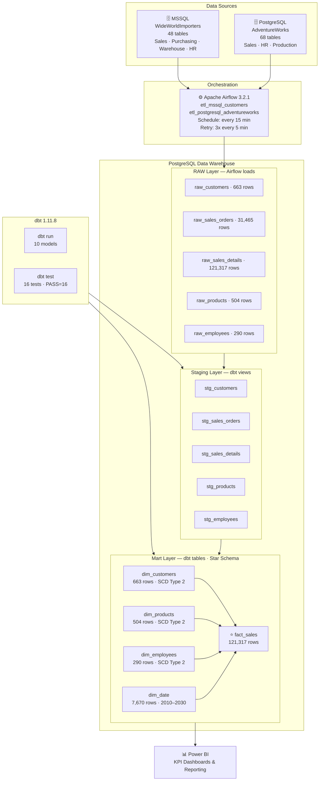

# WideWorldImporters Data Warehouse

Enterprise-grade Data Warehouse pipeline built with modern data engineering tools.
Demonstrates end-to-end data pipeline from multiple sources to a Star Schema data warehouse with automated orchestration, data quality testing, and business intelligence reporting.

---

## Architecture



## Tech Stack

| Layer | Technology | Purpose |
|---|---|---|
| Source #1 | MSSQL + WideWorldImporters | 48 tables — Sales, Purchasing, Warehouse, HR |
| Source #2 | PostgreSQL + AdventureWorks | 68 tables — Sales, HR, Production |
| Orchestration | Apache Airflow 3.2.1 | ETL scheduling, retry logic, monitoring |
| Transformation | dbt 1.11.8 | SQL models, data quality tests |
| Warehouse | PostgreSQL 15 | Star Schema data warehouse |
| Visualization | Power BI | KPI dashboards and reporting |
| Infrastructure | Docker + Docker Compose | Containerized environment |
| Version Control | Git + GitHub | Code versioning and CI/CD |

---

## Project Structure

```
WideWorldImporters-DWH/
├── airflow/
│   └── dags/
│       ├── etl_mssql_dag.py           # ETL from MSSQL WideWorldImporters
│       └── etl_postgresql_dag.py      # ETL from PostgreSQL AdventureWorks
├── dbt/
│   ├── models/
│   │   ├── staging/                   # Raw data cleaning and standardization
│   │   │   ├── stg_customers.sql
│   │   │   ├── stg_products.sql
│   │   │   ├── stg_employees.sql
│   │   │   ├── stg_sales_orders.sql
│   │   │   ├── stg_sales_details.sql
│   │   │   └── schema.yml
│   │   └── marts/                     # Star Schema models
│   │       ├── dim_customers.sql
│   │       ├── dim_products.sql
│   │       ├── dim_employees.sql
│   │       ├── dim_date.sql
│   │       ├── fact_sales.sql
│   │       └── schema.yml
│   └── dbt_project.yml
├── etl/
│   ├── extract/                       # Source extraction/load helpers
│   │   ├── mssql.py
│   │   └── postgresql.py
│   └── transform/
├── docker/
│   ├── docker-compose.yml
│   └── Dockerfile
├── docs/
│   ├── README.md
│   ├── WideWorldImporters-PowerBI.pbix
│   └── etl/
│       └── pipeline_flow.md
├── sql/
│   └── queries/
│       └── init_warehouse.sql
├── docker/.env.example
├── .gitignore
└── README.md
```

---

## Data Warehouse Layers

### RAW Layer
Raw data loaded directly from source systems by Airflow ETL pipeline. No transformations applied.

| Table | Source | Rows |
|---|---|---|
| raw_customers | MSSQL WideWorldImporters | 663 |
| raw_sales_orders | PostgreSQL AdventureWorks | 31,465 |
| raw_sales_details | PostgreSQL AdventureWorks | 121,317 |
| raw_products | PostgreSQL AdventureWorks | 504 |
| raw_employees | PostgreSQL AdventureWorks | 290 |

### Staging Layer
dbt models that clean, rename, and standardize raw data. Built as **views**.

| Model | Description |
|---|---|
| stg_customers | Standardized customer data from WideWorldImporters |
| stg_products | Standardized product data from AdventureWorks |
| stg_employees | Standardized employee data from AdventureWorks |
| stg_sales_orders | Standardized sales order headers |
| stg_sales_details | Standardized sales order lines with calculated line_total |

### Mart Layer — Star Schema
dbt models that implement the Star Schema. Built as **tables** for Power BI performance.

| Model | Type | Rows | Description |
|---|---|---|---|
| dim_customers | Dimension | 663 | Customer master data with SCD Type 2 |
| dim_products | Dimension | 504 | Product master data with SCD Type 2 |
| dim_employees | Dimension | 290 | Employee master data with SCD Type 2 |
| dim_date | Dimension | 7,670 | Date spine from 2010 to 2030 |
| fact_sales | Fact | 121,317 | Sales transactions linking all dimensions |

---

## Data Quality

16 automated dbt tests run on every pipeline execution:

- **unique** — no duplicate primary keys
- **not_null** — no missing values in critical fields
- **relationships** — foreign key integrity between fact and dimension tables

```bash
dbt test
# Done. PASS=16 WARN=0 ERROR=0 SKIP=0 NO-OP=0 TOTAL=16
```

---

## How to Run

### Prerequisites
- Docker Desktop
- Python 3.13
- dbt-postgres

### 1. Clone the repository
```bash
git clone https://github.com/your-username/WideWorldImporters-DWH
cd WideWorldImporters-DWH
```

### 2. Set up environment variables
```bash
cp .env.example docker/.env
# Edit docker/.env with your passwords
```

### 3. Start Docker containers
```bash
cd docker
docker-compose up -d
```

### 4. Initialize DWH metadata tables
```bash
psql -h 127.0.0.1 -p 5434 -U dwh_user -d warehouse_db -f ../sql/queries/init_warehouse.sql
```

### 5. Restore MSSQL database
```bash
docker cp WideWorldImporters-Full.bak mssql_source:/var/opt/mssql/data/
docker exec -it mssql_source /opt/mssql-tools18/bin/sqlcmd \
  -S localhost -U sa -P "your_password" -No \
  -Q "RESTORE DATABASE WideWorldImporters FROM DISK='/var/opt/mssql/data/WideWorldImporters-Full.bak'..."
```

### 6. Run dbt models
```bash
cd dbt
dbt run
dbt test
```

### 7. Access Airflow
```
URL: http://localhost:8080
```

---

## Key Design Decisions

**Why two source databases?**
Demonstrates ability to work with heterogeneous data sources — a common real-world scenario where enterprise data comes from multiple systems.

**Why Star Schema?**
Star Schema is the industry standard for Data Warehouse design. It optimizes query performance for analytical workloads and is natively supported by Power BI.

**Why SCD Type 2?**
Slowly Changing Dimensions preserve historical data. When a customer changes their address, both the old and new address are kept — critical for accurate historical reporting.

**Why dbt?**
dbt brings software engineering best practices to data transformation — version control, testing, documentation, and modular SQL models.

**Why Airflow?**
Airflow provides enterprise-grade pipeline orchestration with scheduling, retry logic, monitoring, and alerting — essential for production data pipelines.
