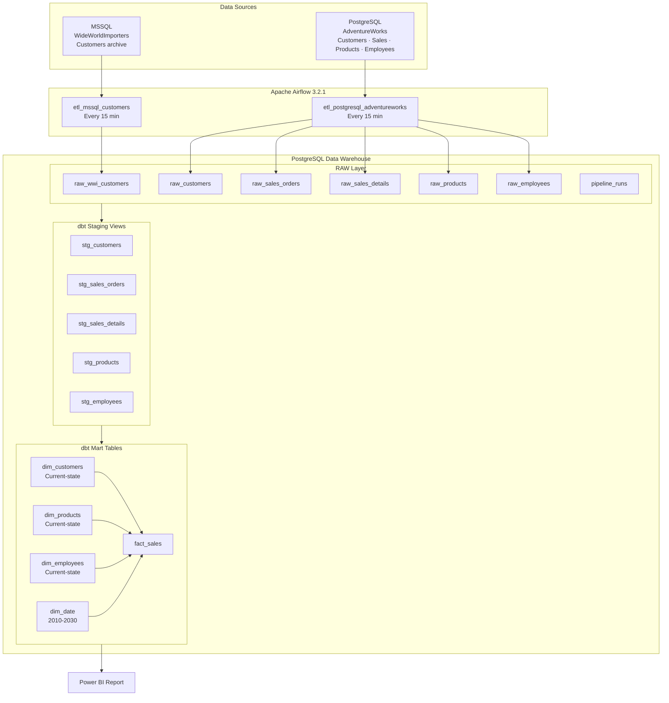

# WideWorldImporters Data Warehouse

End-to-end Data Warehouse project built with Docker, Apache Airflow, dbt, PostgreSQL, MSSQL, and Power BI.

The project demonstrates a multi-source ETL pipeline into a PostgreSQL analytical warehouse. Airflow loads RAW tables, dbt builds staging views and star-schema marts, tests validate data quality, and Power BI consumes the mart layer.

---

## Architecture



## Tech Stack

| Layer | Technology | Purpose |
|---|---|---|
| Source #1 | MSSQL + WideWorldImporters | Separate customer extract into `raw_wwi_customers` |
| Source #2 | PostgreSQL + AdventureWorks | Sales mart source data |
| Orchestration | Apache Airflow 3.2.1 | ETL scheduling, retries, monitoring |
| Transformation | dbt 1.11.8 | SQL models, tests, documentation metadata |
| Warehouse | PostgreSQL 15 | RAW, staging, and mart layers |
| BI | Power BI | Reporting over the mart layer |
| Infrastructure | Docker Compose | Local reproducible runtime |
| CI | GitHub Actions | Airflow DAG import tests and dbt validation |

---

## Project Structure

```text
WideWorldImporters-DWH/
├── .github/workflows/
│   └── dbt_test.yml                  # CI: Airflow import tests + dbt parse/run/test
├── airflow/
│   └── dags/
│       ├── etl_mssql_dag.py          # MSSQL WideWorldImporters DAG
│       └── etl_postgresql_dag.py     # PostgreSQL AdventureWorks DAG
├── dbt/
│   ├── dbt_project.yml
│   └── models/
│       ├── staging/                  # RAW-to-staging views and source tests
│       └── marts/                    # Star-schema mart tables and relationship tests
├── docker/
│   ├── .env.example
│   ├── Dockerfile
│   └── docker-compose.yml
├── docs/
│   ├── README.md
│   ├── WideWorldImporters-PowerBI.pbix
│   ├── etl/pipeline_flow.md
│   └── operations/source_databases.md
├── etl/
│   └── extract/
│       ├── mssql.py
│       └── postgresql.py
├── sql/
│   └── queries/
│       ├── import_adventureworks_required.sql
│       └── init_warehouse.sql
├── scripts/
│   └── convert_adventureworks_csv.py
├── tests/
│   └── test_airflow_dags.py
└── README.md
```

---

## Warehouse Layers

### RAW Layer

RAW tables are loaded by Airflow and initialized by [init_warehouse.sql](sql/queries/init_warehouse.sql).

| Table | Source | Role |
|---|---|---|
| `raw_customers` | AdventureWorks PostgreSQL | Customers used by `fact_sales` |
| `raw_sales_orders` | AdventureWorks PostgreSQL | Sales order headers |
| `raw_sales_details` | AdventureWorks PostgreSQL | Sales order lines |
| `raw_products` | AdventureWorks PostgreSQL | Product master data |
| `raw_employees` | AdventureWorks PostgreSQL | Employee master data |
| `raw_wwi_customers` | WideWorldImporters MSSQL | Separate customer extract, not joined to the sales mart |
| `pipeline_runs` | Airflow ETL metadata | DAG/table load audit records |

### Staging Layer

Staging models are dbt views that normalize names and apply basic filtering.

| Model | Input |
|---|---|
| `stg_customers` | `raw_customers` |
| `stg_sales_orders` | `raw_sales_orders` |
| `stg_sales_details` | `raw_sales_details` |
| `stg_products` | `raw_products` |
| `stg_employees` | `raw_employees` |

### Mart Layer

Mart models are dbt tables optimized for reporting.

| Model | Type | Description |
|---|---|---|
| `dim_customers` | Dimension | AdventureWorks customers aligned with `fact_sales.customer_id` |
| `dim_products` | Dimension | Current-state products |
| `dim_employees` | Dimension | Current-state employees |
| `dim_date` | Dimension | Date spine from 2010-01-01 to 2030-12-31 |
| `fact_sales` | Fact | Sales order lines with quantity, price, discount, tax, freight, and total measures |

The dimensions are current-state tables. They do not preserve historical attribute versions yet.

---

## Data Quality

The dbt project currently defines 50 data tests:

| Test Type | Purpose |
|---|---|
| `not_null` | Ensures required keys and measures are populated |
| `unique` | Ensures dimension keys and fact line keys are not duplicated |
| `relationships` | Ensures `fact_sales` keys resolve to dimension tables |

CI also runs Airflow DAG import tests from [test_airflow_dags.py](tests/test_airflow_dags.py).

---

## How To Run

### Prerequisites

- Docker Desktop
- Python 3.13
- dbt-postgres installed locally, or use the existing `.venv`
- MSSQL WideWorldImporters `.bak` file if you want to load the MSSQL source
- AdventureWorks data restored into `postgres_source` if you want real sales data

### 1. Configure Environment

```powershell
Copy-Item docker\.env.example docker\.env
```

Edit `docker/.env` and set the passwords/database names.

### 2. Start Containers

```powershell
cd docker
docker compose up -d --build
docker compose ps
```

Airflow is available at:

```text
http://localhost:8080
```

### 3. Initialize The Warehouse

From the repository root:

```powershell
docker compose -f docker\docker-compose.yml cp sql\queries\init_warehouse.sql postgres_dwh:/tmp/init_warehouse.sql
docker compose -f docker\docker-compose.yml exec postgres_dwh sh -c 'psql -U "$POSTGRES_USER" -d "$POSTGRES_DB" -f /tmp/init_warehouse.sql'
```

This creates RAW tables and `pipeline_runs`.

### 4. Restore Source Data

Use [source_databases.md](docs/operations/source_databases.md) as the operational runbook for source database targets, backup/restore, AdventureWorks CSV import, and validation checks.

Restore WideWorldImporters into `mssql_source` if you want the MSSQL customer extract:

```powershell
docker cp WideWorldImporters-Full.bak mssql_source:/var/opt/mssql/data/
```

Then restore the database inside SQL Server with `sqlcmd`.

Load AdventureWorks CSV data into `postgres_source` using [import_adventureworks_required.sql](sql/queries/import_adventureworks_required.sql). The PostgreSQL DAG expects these source tables:

| Source Table |
|---|
| `sales.customer` |
| `person.person` |
| `sales.store` |
| `sales.salesorderheader` |
| `sales.salesorderdetail` |
| `production.product` |
| `humanresources.employee` |

### 5. Run Airflow ETL

In Airflow UI, enable or trigger:

| DAG | Loads |
|---|---|
| `etl_mssql_customers` | `raw_wwi_customers` |
| `etl_postgresql_adventureworks` | `raw_customers`, `raw_sales_orders`, `raw_sales_details`, `raw_products`, `raw_employees` |

### 6. Run dbt

From the dbt directory:

```powershell
cd dbt
..\.venv\Scripts\dbt.exe parse
..\.venv\Scripts\dbt.exe run
..\.venv\Scripts\dbt.exe test
```

If `dbt` is installed globally, use:

```powershell
dbt parse
dbt run
dbt test
```

### 7. Run Airflow DAG Import Tests

From the Docker directory:

```powershell
cd docker
docker compose exec airflow python -m unittest discover -s /opt/airflow/tests -p "test_*.py"
```

Expected result:

```text
Ran 3 tests
OK
```

---

## CI

GitHub Actions workflow [dbt_test.yml](.github/workflows/dbt_test.yml) runs on push and pull request to `main`.

It validates:

1. Python dependency installation.
2. Airflow DAG imports.
3. dbt project parsing.
4. DWH initialization through `sql/queries/init_warehouse.sql`.
5. dbt model build.
6. dbt data tests.

---

## Design Decisions

**Two source databases**

The project keeps MSSQL WideWorldImporters and PostgreSQL AdventureWorks as separate source systems to demonstrate heterogeneous extraction.

**AdventureWorks customer dimension**

`fact_sales.customer_id` comes from AdventureWorks sales orders, so `dim_customers` is built from AdventureWorks customers. WideWorldImporters customers are loaded separately into `raw_wwi_customers` to avoid mixing incompatible customer ID spaces.

**Star schema**

The mart layer uses `fact_sales` plus customer, product, employee, and date dimensions because this is a simple and Power BI-friendly analytical model.

**Current-state dimensions**

Dimension tables currently represent the latest source attributes. Historical SCD Type 2 tracking can be added later with dbt snapshots or incremental dimension logic.

**dbt tests**

Tests are part of the model contract: key uniqueness, required fields, and fact-to-dimension integrity are validated before reporting.
